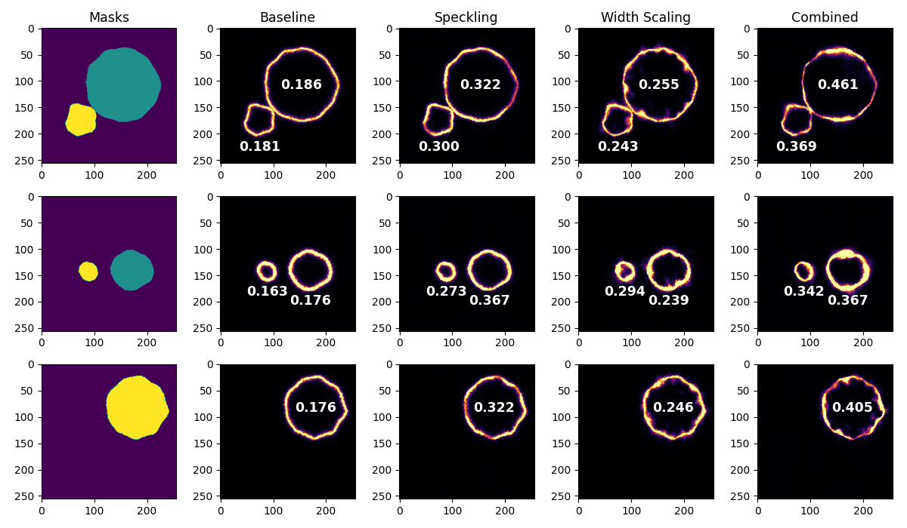

# Heterogeneous Synthetic Cells by Sampling

This repository provides a resources to generate synthetic cell images by sampling.
The goal is to leverage synthetic data to improve segmentation performance on real-world images.

The pipeline is organized into **four main execution stages**, each controlled by a Bash script and parameterized via configuration files.


---

## Repository Structure

```
.
├── Fluo-C3DH-A549/               # Test data from Cell Tracking Challenge
├── Fluo-C3DH-A549-train/         # Annotated training data from Cell Tracking Challenge
├── main/                         # All executable scripts (run commands from here)
│   ├── scripts/
│   │   └── default/
│   │       ├── TrainData.sh      # Sample Fluorescence and Generate dataset with synthetic images with labels
│   │       └── ...
│   ├── config/                   # Configuration files for each stage
│   ├── data_generator/           # Scripts for sampling, and shape + image generation
│   ├── synthetic_data/           # Where synthetic training images are stored
│   ├── utils/
│   └── ...
```

---

## Pipeline Overview

Each step:

* Is executed via a Bash script
* Loads parameters from configuration files located in `main/config/`
* Produces outputs that feed into the next stage
---

## Installation

Clone the repository into an arbitrary directory:

```
git clone https://github.com/adam96smith/heterogeneous-cells-by-sampling.git
cd heterogeneous-cells-by-sampling/
```

All scripts use standard NumPy, SciPy and matplotlib functions. Only installations are for data handling:

```
pip install tifffile h5py
```

**Important:** All scripts must be executed **from the `main/` directory**
```
cd main
```

---

## Execution

**Script:**

```bash
bash scripts/default/TrainData.sh
```

### 1. Sampling

```
python data_generator/default/GeneratorSampler.py
...
```

Using ground truth annotations, the intensity values from real images are grouped based on intervals of a distance map.
The formatted data is used to texture synthetic images (stored in `data_generator/sampled_data/`)

### Parameters

Located in:

```
main/config/global_parameters.yaml
```

| Parameter      | Description                          |
| -------------- | ------------------------------------ |
| `SAMPLING`     | Voxel size in $\mu m$                |
| `DX`           | Distance interval width              |
| `MIN_DIST`     | Minimum distance sampled             |
| `MAX_DIST`     | Maximum distance sampled             |

**Recommended**: DX should be no lower than 2x the in-plane sampling.

### 2. Mask Generation

**Script:**

```
python data_generator/default/GeneratorMask.py
...
```

### Purpose

Generates cell shapes used as input to texturing process.

### Parameters

Located in:

```
main/config/synth_parameters.yaml
```

| Parameter                | Description                                                |
| ------------------------ | ---------------------------------------------------------- |
|  `IMAGE_SIZE`            | Size of synthetic images                                   |
|  `CELL_N`                | Max. number of cells to add to synthetic volume (range)    |
|  `CELL_R`                | A range of value to sample for each cell radius            |
|  `CELL_SEPARATION`       | Separation parameter. >1 no contact, <1 overlap            |
|  `CELL_COUPLING_CHANCE`  | Probability of new cell coupling with existing cell        |
|  `DEFORM_1/2`            | [Grid points, Amplitude]  of deformation with Perlin noise |

**Note:** Cells will be added until maximum number reached, or constraints do not allow any more cells to be added to volume.

### 2. Image Generation

**Script:**

```
python data_generator/default/GeneratorImage.py
...
```

### Purpose

This script runs GeneratorMask.py to get cell shapes, GeneratorImage.py to get synthetic images and GeneratorCurveSeg.py for curvature mask.
All images are stored in `synthetic_data/A549/`, with images inside `custom_texture/`. 
**Note:**: Custom script for A549 cells is 'data_generator/custom_A549/GeneratorMask.py`, the alternative in `default/` generates generic masks with specified shape.


### Parameters

Located in:

```
main/config/synth_parameters.yaml
```

| Parameter        | Description                                      |
| ---------------- | ------------------------------------------------ |
|  `IMAGE_SIZE`    | Size of synthetic images                         |
|  `DISTMAP_BLUR`  | If True, blur the distance map used in sampling  |
|  `DISTMAP_SIG`   | Sigma used to blur distances (**in $\mu m$**)    |
|  `GAUSSIAN_BLUR` | If True, apply blur to the final image           |
|  `GAUSSIAN_SIG`  | Sigma used to blur image (**in pixels**)         |

**Note:** Applying a blur to the distance map reduces the block effect caused by sampling at distance intervals.


